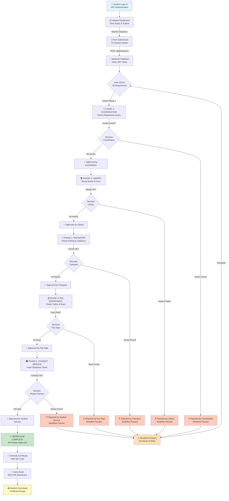
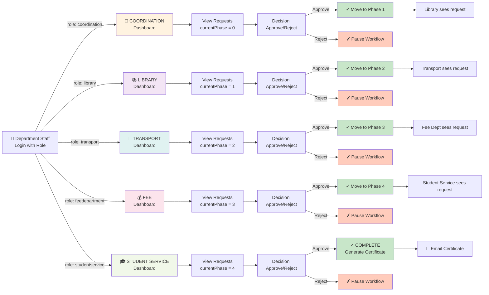
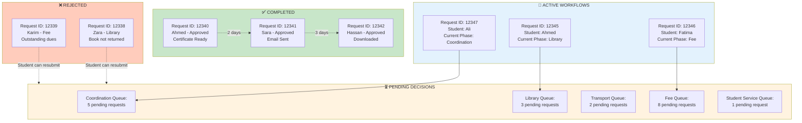
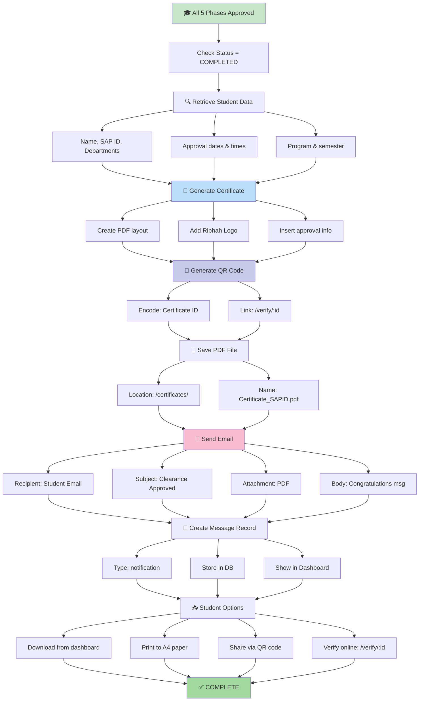
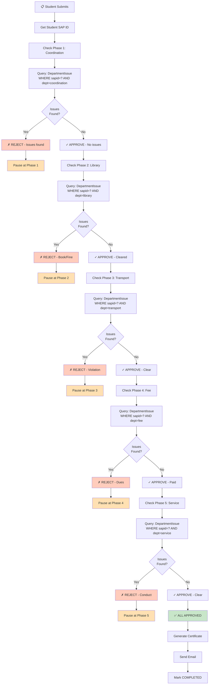
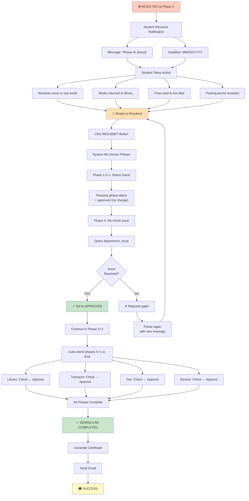
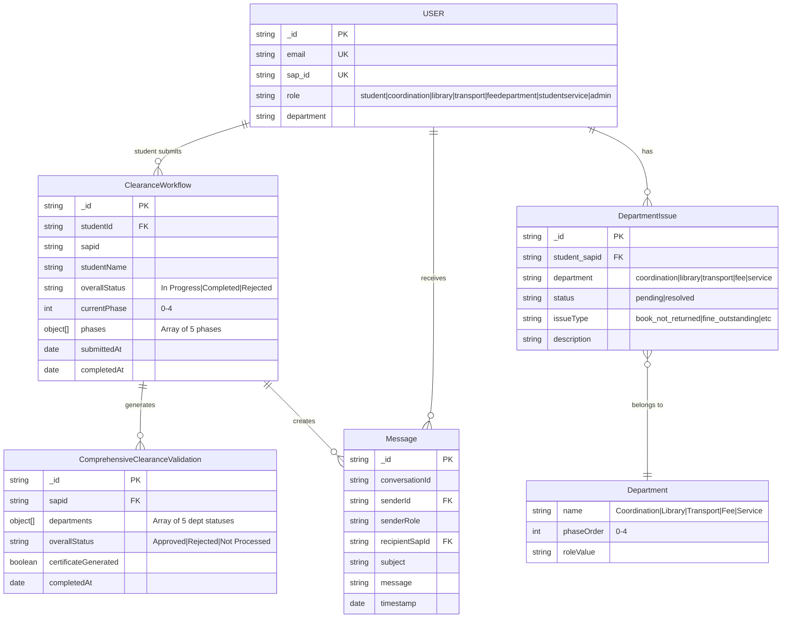

# 🎯 Department Workflow - Mermaid Diagrams

## Complete System Flow Diagram



---

## Department Dashboard Access Pattern



---

## Student Request Lifecycle - Detailed

```mermaid
stateDiagram-v2
    [*] --> SubmittingRequest: Click Submit
    
    SubmittingRequest --> ValidationCheck: Form Complete
    
    ValidationCheck --> AutoCheck{Auto-Check<br/>Department Issues}
    
    AutoCheck -->|All Clear| PhaseCoordination: Start Phase 1
    AutoCheck -->|Issues Found| ImmediateReject: Rejected
    
    ImmediateReject --> StudentNotified1: "Issues found,<br/>Please fix"
    StudentNotified1 --> ResubmitReady: Ready to Resubmit
    ResubmitReady --> ResubmitFlow: Click Resubmit
    ResubmitFlow --> AutoCheck
    
    PhaseCoordination --> CoordDecision{Coordination<br/>Reviews}
    CoordDecision -->|Reject| CoordReject: Rejected
    CoordDecision -->|Approve| PhaseLibrary: Move to Phase 2
    
    CoordReject --> StudentNotified2: Notify Student
    StudentNotified2 --> ResubmitReady
    
    PhaseLibrary --> LibDecision{Library<br/>Reviews}
    LibDecision -->|Reject| LibReject: Rejected
    LibDecision -->|Approve| PhaseTransport: Move to Phase 3
    
    LibReject --> StudentNotified3: Notify Student
    StudentNotified3 --> ResubmitReady
    
    PhaseTransport --> TransDecision{Transport<br/>Reviews}
    TransDecision -->|Reject| TransReject: Rejected
    TransDecision -->|Approve| PhaseFee: Move to Phase 4
    
    TransReject --> StudentNotified4: Notify Student
    StudentNotified4 --> ResubmitReady
    
    PhaseFee --> FeeDecision{Fee Dept<br/>Reviews}
    FeeDecision -->|Reject| FeeReject: Rejected
    FeeDecision -->|Approve| PhaseService: Move to Phase 5
    
    FeeReject --> StudentNotified5: Notify Student
    StudentNotified5 --> ResubmitReady
    
    PhaseService --> ServiceDecision{Student Service<br/>Reviews}
    ServiceDecision -->|Reject| ServiceReject: Rejected
    ServiceDecision -->|Approve| AllApproved: All Phases OK
    
    ServiceReject --> StudentNotified6: Notify Student
    StudentNotified6 --> ResubmitReady
    
    AllApproved --> GenerateCert: Generate Certificate
    GenerateCert --> GenerateQR: Create QR Code
    GenerateQR --> SendEmail: Send Email with PDF
    SendEmail --> AvailableDownload: Ready for Download
    
    AvailableDownload --> StudentDownloads: Student Downloads
    StudentDownloads --> Completed: ✅ COMPLETED
    
    Completed --> [*]
```

---

## Parallel Department View During Processing



---

## Certificate Generation & Distribution Flow



---

## Admin Dashboard Overview

```mermaid
graph TB
    Admin["🔧 Admin Dashboard"]
    
    Admin --> Stats["📊 Statistics"]
    Stats --> S1["Total workflows: 2,459"]
    Stats --> S2["Completed: 2,245 (91%)"]
    Stats --> S3["In Progress: 140"]
    Stats --> S4["Rejected: 74"]
    
    Admin --> DeptPerf["🏢 Department Performance"]
    DeptPerf --> D1["Coordination: 98% approval"]
    DeptPerf --> D2["Library: 85% approval"]
    DeptPerf --> D3["Transport: 95% approval"]
    DeptPerf --> D4["Fee: 78% approval"]
    DeptPerf --> D5["Student Service: 96% approval"]
    
    Admin --> Users["👥 User Management"]
    Users --> U1["Add/Edit staff"]
    Users --> U2["View activity logs"]
    Users --> U3["Reset passwords"]
    
    Admin --> Reports["📈 Reports"]
    Reports --> R1["Monthly trends"]
    Reports --> R2["Department comparison"]
    Reports --> R3["Student demographics"]
    Reports --> R4["Export to Excel"]
    
    Admin --> Override["⚙️ System Control"]
    Override --> O1["Manual approve/reject"]
    Override --> O2["Reset workflows"]
    Override --> O3["Generate certificates"]
    Override --> O4["Bulk messages"]
    
    style Admin fill:#f5f5f5
    style Stats fill:#e1f5fe
    style DeptPerf fill:#f3e5f5
    style Users fill:#ffe0b2
    style Reports fill:#c8e6c9
    style Override fill:#ffccbc
```



---

## Department Issue Checking Logic



---

## Resubmission Workflow



---

## Data Model Relationships



---

**All diagrams show the complete working of 7 departments in the system:**
- ✅ Student Department (Portal/Submission)
- ✅ System Admin (Control/Analytics)  
- ✅ Coordination (Phase 1/Gate 1)
- ✅ Library (Phase 2/Gate 2)
- ✅ Transport (Phase 3/Gate 3)
- ✅ Fee Department (Phase 4/Gate 4)
- ✅ Student Service (Phase 5/Gate 5)
